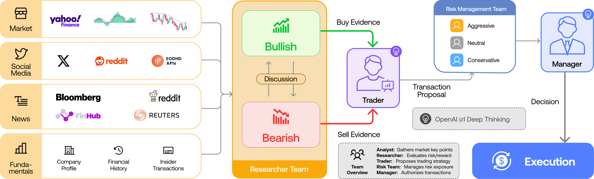

<p align="center">
  
</p>

---

# TradingAgents: Multi-Agents LLM Financial Trading Framework

> 部署多智能体 LLM（DeepSeek 驱动），模拟真实交易公司运作——分析师调研 → 多空辩论 → 交易员制定计划 → 风控评估 → 组合经理决策，一键生成买卖评级与完整中文报告，支持港股、A股、加密货币。

<p align="center">
  
</p>

---

## 🚀 快速启动

### 0️⃣ 前置准备

```bash
# 1. 创建 .env（填入 DEEPSEEK_API_KEY）
echo "DEEPSEEK_API_KEY=sk-xxxxx" > .env

# 2. 克隆项目
git clone https://github.com/haolan0427/TradingAgents.git
cd TradingAgents

# 3. 创建虚拟环境并安装依赖
conda create -n tradingagents python=3.12 -y
conda activate tradingagents
pip install .
```

---

### 1️⃣ 本地启动（分三个终端）

```bash
# 终端 1：启动 Redis（需先 brew install redis）
redis-server

# 终端 2：启动 RQ Worker
conda activate tradingagents
export OBJC_DISABLE_INITIALIZE_FORK_SAFETY=YES
rq worker trading-tasks

# 终端 3：启动 FastAPI Server
conda activate tradingagents
uvicorn server.server:app --host 0.0.0.0 --port 8000 --reload
```

> 如果遇到缓存问题，可先执行：`redis-cli FLUSHALL` 并清理 `find . -path "*/__pycache__" -exec rm -rf {} + 2>/dev/null; true`

---

### 2️⃣ Docker 启动

```bash
# 启动 Redis + Worker（后台运行）
docker compose up -d

# 在宿主机上启动 FastAPI Server（需 conda 环境）
conda activate tradingagents
uvicorn server.server:app --host 0.0.0.0 --port 8000

# 常用命令
docker compose logs -f            # 查看日志
docker compose up -d --scale worker=3   # 扩展 Worker
docker compose down               # 关闭
```

---

### 3️⃣ 访问 Web UI

浏览器打开 **http://localhost:8000**，即可使用深色主题交互界面：
- 左侧面板配置分析参数（分析师、研究深度、LLM 模型）
- 🔍 按钮验证股票代码
- 提交后实时查看进度
- 分析完成后 ⬇️ 下载完整中文报告

---

## 🔌 API 接口测试

```bash
# 健康检查
curl http://localhost:8000/api/health

# 获取支持的配置选项
curl http://localhost:8000/api/info | python3 -m json.tool

# 验证股票代码
curl -X POST http://localhost:8000/api/validate \
  -H "Content-Type: application/json" \
  -d '{"ticker":"0700.HK"}'

# 提交分析任务
TASK_ID=$(curl -X POST http://localhost:8000/api/analyze \
  -H "Content-Type: application/json" \
  -d '{
    "ticker": "0700.HK",
    "date": "2024-05-10",
    "analysts": ["market", "social", "news", "fundamentals"],
    "research_depth": "shallow",
    "quick_think_llm": "deepseek-v4-flash",
    "deep_think_llm": "deepseek-v4-pro",
    "output_language": "Chinese",
    "save_report": true
  }' | python3 -c "import sys,json; print(json.load(sys.stdin)['task_id'])")
echo "Task ID: $TASK_ID"

# 轮询任务进度
while true; do
  clear
  curl -s "http://localhost:8000/api/result/${TASK_ID}" | python3 -c "
import sys, json
data = json.load(sys.stdin)
print(f'Status: {data.get(\"status\")}')
print(f'Message: {data.get(\"progress\", {}).get(\"message\", \"N/A\")}')
result = data.get('result', {})
if result:
  print(f'Signal: {result.get(\"signal\", \"N/A\")}')
  print(f'Ticker: {result.get(\"ticker\")}')
if data.get('error'):
  print(f'ERROR: {data[\"error\"][:200]}...')
"
  sleep 10
done

# 或仅提交 Market Analyst 快速测试
TASK_ID=$(curl -X POST http://localhost:8000/api/analyze \
  -H "Content-Type: application/json" \
  -d '{
    "ticker": "0700.HK",
    "date": "2024-05-10",
    "analysts": ["market"],
    "research_depth": "shallow",
    "quick_think_llm": "deepseek-v4-flash",
    "deep_think_llm": "deepseek-v4-pro",
    "output_language": "Chinese",
    "save_report": true
  }' | python3 -c "import sys,json; print(json.load(sys.stdin)['task_id'])")
echo "Task ID: $TASK_ID"
curl http://localhost:8000/api/result/$TASK_ID | python3 -m json.tool
```

---

## 🧠 框架架构

TradingAgents 通过 LangGraph 编排多个 LLM 智能体，模拟真实交易公司运作：

| 角色 | 职责 |
|---|---|
| **基本面分析师** | 评估公司财务指标，识别内在价值与潜在风险 |
| **情绪分析师** | 聚合新闻、StockTwits、Reddit 舆情，判断短期市场情绪 |
| **新闻分析师** | 监控全球宏观事件，解读对市场的影响 |
| **技术分析师** | 利用 MACD、RSI 等技术指标预测价格走势 |
| **多空研究员** | 通过结构化辩论平衡收益与风险 |
| **交易员** | 综合研报制定交易时机与仓位 |
| **风控团队** | 评估波动率、流动性等风险，调整策略 |
| **组合经理** | 最终审批交易提案 |

<p align="center">
  
</p>
<p align="center">
  
</p>
<p align="center">
  
</p>
<p align="center">
  
</p>

---

## 📊 支持的市场

| 市场 | 后缀 | 示例 | 基准指数 |
|---|---|---|---|
| 港股 | `.HK` | `0700.HK`（腾讯） | ^HSI |
| A 股 | `.SS` / `.SZ` | `600519.SS`（茅台） | 上证综指 / 深证成指 |
| 加密货币 | `-USD` | `BTC-USD` | — |

> 美股及其他交易所（`.T` 东京、`.L` 伦敦、`.NS` 印度等）**不支持**。
